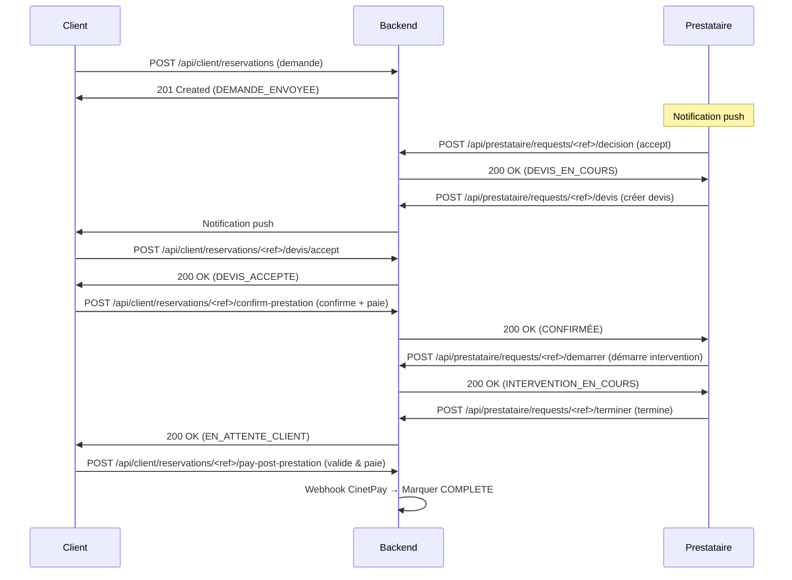

# 🏠 BABIFIX - Plateforme de Services à Domicile

> **Plateforme full-stack de réservation de prestataires de services en Côte d'Ivoire**  
> Architecture microservices : Django REST API + Flutter (Client & Prestataire)


---

## 📋 Table des matières

- [Architecture](#architecture)
- [Stack technique](#stack-technique)
- [Fonctionnalités](#fonctionnalités)
- [Installation & démarrage](#installation--démarrage)
- [Configuration](#configuration)
- [API Endpoints](#api-endpoints)
- [Flux métier](#flux-métier)
- [Scripts utiles](#scripts-utiles)
- [Contribuer](#contribuer)
- [Licence](#licence)

---

## 🏗️ Architecture

```
┌─────────────────────────────────────────────────────────────────────┐
│                          Internet / Mobile                          │
├─────────────────────────────────────────────────────────────────────┤
│                         Load Balancer (Nginx)                       │
├─────────────┬───────────────────────┬───────────────────────────────┤
│   Client    │   Prestataire App     │   Admin Dashboard              │
│   Flutter   │   Flutter (Android/iOS│   Django Admin + React          │
│   (APK/IPA) │   /Web)               │   (babifix_admin_django)        │
└─────┬───────┴───────────┬───────────┴───────────────┬───────────────┘
      │                   │                           │
      │ REST API / JSON   │ REST API / JSON          │ REST API / JSON
      │ (HTTPS)           │ (HTTPS)                  │ (HTTPS)
      ▼                   ▼                           ▼
┌─────────────────────────────────────────────────────────────────────┐
│              Django REST Framework (API Central)                    │
│  ┌───────────────────────────────────────────────────────────────┐ │
│  │  Views • Serializers • Services • Auth • WebSockets • Push   │ │
│  └───────────────────────────────────────────────────────────────┘ │
├─────────────────────────────────────────────────────────────────────┤
│                         PostgreSQL 16                              │
│            (Users, Reservations, Payments, KYC, etc.)              │
├─────────────────────────────────────────────────────────────────────┤
│                         Redis (Cache + WS)                         │
└─────────────────────────────────────────────────────────────────────┘
```

---

## 🛠️ Stack technique

### Backend — Django
| Composant | Version | Rôle |
|-----------|---------|------|
| Django | 5.2 | Framework principal |
| Django REST Framework | 3.15 | API REST |
| Django Channels | 4.1 | WebSockets (temps réel) |
| PostgreSQL | 16 | Base de données |
| Redis | 7 | Cache + Broker channels |
| Celery | 5.4 | Tâches asynchrones |
| Daphne | 4.1 | Serveur ASGI |

### Frontend — Flutter
| Composant | Version | Rôle |
|-----------|---------|------|
| Flutter SDK | 3.24 | Framework mobile |
| Dart | 3.5 | Langage |
| Provider | ^6.11 | State management |
| GoRouter | ^14.0 | Navigation |
| http | ^1.2 | Client API |
| socket_io_client | ^2.0 | WebSockets |
| firebase_messaging | ^15.2 | Push notifications |
| flutter_secure_storage | ^9.2 | Stockage sécurisé tokens |

### DevOps & Outils
- **Git** - Versioning
- **Makefile** - Orchestration des commandes
- **Docker & docker-compose** - Conteneurisation (optionnel)
- **Gunicorn + Daphne** - Serveurs de production
- **Nginx** - Reverse proxy + static files
- **Sentry** - Monitoring erreurs

---

## ✨ Fonctionnalités

### 👤 Client Flutter (`babifix_client_flutter`)
- **Inscription / Connexion** (email, téléphone, Google, Apple)
- **Recherche de prestataires** (filtres : catégorie, localisation, notes)
- **Réservations** (création, suivi, annulation)
- **Messagerie temps réel** (WebSocket)
- **Paiement sécurisé** (CinetPay Mobile Money / Carte)
- **Historique & factures** (PDF)
- **Fidélité & parrainage** (codes promo, crédits wallet)
- **Notifications Push** (Firebase)

### 🔧 Prestataire Flutter (`babifix_prestataire_flutter`)
- **Espace prestataire** (dashboard, statistiques)
- **Gestion des disponibilités** (créneaux hebdomadaires, congés)
- **Demandes de réservation** (accept/refuse, devis)
- ** Intervention en temps réel** (démarrer/terminer, photos)
- **KYC / Vérification identité** (upload documents, statut)
- **Contrat numérique** (signature électronique)
- **Wallet & retraits** (solde, historique, demandes)
- **Parrainage** (code parrain, crédits)
- **Premium** (abonnement Bronze/Silver/Gold)

### ⚙️ Admin Django (`babifix_admin_django`)
- **Backoffice complet** (validation prestataires, KYC, réservations)
- **Gestion financière** (transactions, commissions, retraits)
- **Statistiques & Analytics** (revenus, croissance)
- **Push notifications broadcast**
- **Export CSV** (réservations, paiements, utilisateurs)
- **Modération** (litiges, signalements)
- **Audit log** (trace des actions admin)

---

## 📦 Installation & Démarrage

### Prérequis
- **Python 3.12+** (avec pip, venv)
- **Node.js 20+** + **Flutter 3.24+**
- **PostgreSQL 16** + **Redis 7**
- **Git**

### 1. Cloner le dépôt
```bash
git clone https://github.com/votre-org/babifix-build.git
cd BABIFIX_BUILD
```

### 2. Backend — Django
```bash
# Créer et activer l'environnement virtuel
cd babifix_admin_django
python -m venv ../venv
.\..\venv\Scripts\Activate.ps1  # PowerShell (Windows)
# ou source venv/bin/activate (Mac/Linux)

# Installer les dépendances
pip install -r requirements.txt

# Configurer la base de données
python manage.py migrate
python manage.py collectstatic --noinput

# Créer un superutilisateur admin
python manage.py createsuperuser

# Lancer le serveur de développement
python manage.py runserver 0.0.0.0:8002
```
→ API accessible sur **http://localhost:8002**

### 3. Client Flutter
```bash
cd babifix_client_flutter
flutter pub get
flutter run --release  # ou flutter run -d android
```
→ APK généré dans `build/app/outputs/flutter-apk/`

### 4. Prestataire Flutter
```bash
cd babifix_prestataire_flutter
flutter pub get
flutter run --release
```

### 5. (Optionnel) Docker Compose
```bash
docker-compose up -d
```
→ Stack complète : PostgreSQL + Redis + Django + Nginx

---

## ⚙️ Configuration

### Variables d'environnement (.env)
Créer un fichier `.env` à la racine de `babifix_admin_django/` :

```bash
# Django
SECRET_KEY=your-secret-key-here
DEBUG=True
ALLOWED_HOSTS=localhost,127.0.0.1

# Database
DB_NAME=babifix
DB_USER=babifix_user
DB_PASSWORD=your_password
DB_HOST=localhost
DB_PORT=5432

# Redis & Channels
REDIS_URL=redis://localhost:6379/0

# Firebase (Flutter)
FIREBASE_PROJECT_ID=babifix
FIREBASE_ANDROID_API_KEY=...
FIREBASE_IOS_API_KEY=...

# CinetPay (paiements)
CINETPAY_SITE_ID=...
CINETPAY_SECRET_KEY=...

# AWS S3 (uploads KYC photos)
AWS_ACCESS_KEY_ID=...
AWS_SECRET_ACCESS_KEY=...
AWS_STORAGE_BUCKET_NAME=babifix-kyc
AWS_S3_REGION=af-south-1
```

### Firebase Configuration
Les fichiers `firebase_options.dart` sont générés via :
```bash
flutterfire configure
```
Ils se trouvent dans :
- `babifix_client_flutter/lib/firebase_options.dart`
- `babifix_prestataire_flutter/lib/firebase_options.dart`

---

## 🌐 API Endpoints

### Public
| Endpoint | Méthode | Description |
|----------|---------|-------------|
| `/api/public/providers/` | GET | Liste des prestataires |
| `/api/public/categories/` | GET | Catégories de services |
| `/api/public/vitrine/` | GET | Page d'accueil publique |

### Authentification
| Endpoint | Méthode | Description |
|----------|---------|-------------|
| `/api/auth/register` | POST | Inscription (client/prestataire) |
| `/api/auth/login` | POST | Connexion |
| `/api/auth/me` | GET | Profil utilisateur connecté |
| `/api/auth/refresh` | POST | Rafraîchir token JWT |
| `/api/auth/forgot-password` | POST | Reset mot de passe |

### Client
| Endpoint | Méthode | Description |
|----------|---------|-------------|
| `/api/client/home` | GET | Dashboard client |
| `/api/client/reservations` | POST | Créer une réservation |
| `/api/client/reservations/list` | GET | Liste réservations client |
| `/api/client/favorites/` | GET/POST | Favoris prestataires |
| `/api/client/fidelite/` | GET | Crédits fidélité |

### Prestataire
| Endpoint | Méthode | Description |
|----------|---------|-------------|
| `/api/prestataire/me` | GET | Profil prestataire |
| `/api/prestataire/availability/slots/` | GET/POST/DELETE | Gestion créneaux |
| `/api/prestataire/availability/unavailability/` | GET/POST/DELETE | Gestion congés |
| `/api/prestataire/requests` | GET | Demandes entrantes |
| `/api/prestataire/requests/<ref>/decision` | POST | Accepter/refuser |
| `/api/prestataire/requests/<ref>/devis` | POST | Créer un devis |
| `/api/prestataire/earnings` | GET | Revenus (wallet) |
| `/api/prestataire/wallet/` | GET | Solde wallet |
| `/api/prestataire/wallet/withdraw/` | POST | Demande de retrait |
| `/api/prestataire/kyc/status/` | GET | Statut KYC |
| `/api/prestataire/kyc/submit/` | POST | Soumettre KYC |
| `/api/prestataire/contrat/` | GET | Détail contrat |
| `/api/prestataire/contrat/sign/` POST | Signer contrat |
| `/api/auth/referral/` | GET/POST | Parrainage (code, stats) |
| `/api/prestataire/premium/tiers/` | GET | Tiers premium |
| `/api/prestataire/premium/subscribe/` | POST | Abonnement premium |

### Admin
| Endpoint | Méthode | Description |
|----------|---------|-------------|
| `/api/admin/platform-revenue/` | GET | Revenus plateforme |
| `/api/admin/reservations/<ref>/cash-validate` | POST | Valider paiement cash |
| `/api/admin/prestataires/bulk-action/` | POST | Actions bulk prestataires |
| `/api/admin/export/<kind>/` | GET | Export CSV |

---

## 🔄 Flux métier

### 1. Flow Demande → Devis → Paiement → Intervention



### 2. Flow Parrainage
1. Parrain génère son code via `GET /api/auth/referral/`
2. Filleul s'inscrit avec code → crédit 2000 FCFA parrain + 1000 FCFA filleul (1ère résa)
3. Transactions créées dans `WalletTransaction`

### 3. Flow KYC
1. Prestataire remplit formulaire KYC dans l'app → `POST /api/prestataire/kyc/submit/`
2. Documents sauvegardés (base64 → S3)
3. Statut = `pending`
4. Admin examine via backoffice → statut = `approved` / `rejected`
5. Prestataire notifié par push

---

## 🎨 Palette de couleurs

| Rôle | Couleur | Usage |
|------|---------|-------|
| Primary Navy | `#0F172A` | Fond sombre, headers |
| Accent Emerald | `#10B981` | Validation, succès |
| Cyan | `#06B6D4` (#4CC9F0) | Boutons principaux |
| Orange | `#F59E0B` | Avertissements |
| Red | `#EF4444` | Erreurs, suppression |

---

## 📁 Structure du projet

```
BABIFIX_BUILD/
├── babifix_admin_django/         # Backend Django (API + Admin)
│   ├── adminpanel/
│   │   ├── models.py             # Tous les modèles (UserProfile, Provider, Reservation…)
│   │   ├── views.py              # Vues API principales
│   │   ├── views_extra.py        # Vues supplémentaires (dispo, KYC, contrat…)
│   │   ├── services/             # Services métier
│   │   │   ├── reservation_service.py
│   │   │   ├── referral_service.py
│   │   │   └── …
│   │   ├── serializers.py
│   │   ├── urls.py               # Routes API
│   │   └── …
│   ├── manage.py
│   └── requirements.txt
│
├── babifix_client_flutter/       # App Client Mobile (Android/iOS)
│   ├── lib/
│   │   ├── main.dart
│   │   ├── features/
│   │   │   ├── auth/
│   │   │   ├── home/
│   │   │   ├── reservations/
│   │   │   ├── parrainage/
│   │   │   └── …
│   │   ├── shared/
│   │   │   ├── services/
│   │   │   │   ├── babifix_user_store.dart  # Session + API calls
│   │   │   │   └── …
│   │   │   └── widgets/
│   │   ├── core/
│   │   │   ├── babifix_api_config.dart
│   │   │   └── babifix_design_system.dart
│   │   └── firebase_options.dart
│   ├── pubspec.yaml
│   └── android/ ios/ web/
│
├── babifix_prestataire_flutter/  # App Prestataire Mobile
│   ├── lib/
│   │   ├── features/
│   │   │   ├── availability/      # Gestion créneaux + congés
│   │   │   ├── kyc/               # Vérification identité
│   │   │   ├── contrat/           # Contrat numérique
│   │   │   ├── premium/           # Abonnement premium
│   │   │   ├── parrainage/        # Programme de parrainage
│   │   │   ├── earnings/          # Wallet & revenus
│   │   │   └── …
│   │   └── shared/…
│   ├── pubspec.yaml
│   └── …
│
├── venv/                         # Environnement virtuel Python
├── docker-compose.yml            # Stack complète (Postgres, Redis, Nginx…)
├── Makefile                      # Commandes courtes
├── start_babifix.bat             # Windows : lance tout
├── START_BABIFIX.ps1             # PowerShell : lance tout
└── README.md                     # Ce fichier
```

---

## 🚀 Commandes utiles

### Via Makefile (recommandé)
```bash
make help          # Affiche toutes les commandes
make backend       # Lance le backend Django
make client        # Lance l'app client Flutter
make prestataire   # Lance l'app prestataire
make dev           # Lance tout en mode développement
make prod          # Build production (APK + serveur)
make test          # Exécute les tests
make lint          # Linting Python + Dart
make format        # Formatage auto (black + dart format)
make clean         # Nettoie tous les caches
```

### Manuelles
```bash
# Backend
cd babifix_admin_django
python manage.py runserver 0.0.0.0:8002

# Migrations
python manage.py makemigrations
python manage.py migrate

# Shell Django
python manage.py shell

# Tests Python
pytest adminpanel/tests/

# Flutter
flutter pub get
flutter analyze
flutter test
flutter build apk --release
flutter build ios --release

# Nettoyage Flutter
flutter clean
```

---

## 🧪 Tests

### Backend Django
```bash
cd babifix_admin_django
pytest adminpanel/tests/
# ou
python manage.py test adminpanel
```

### Flutter
```bash
# Unit tests
flutter test

# Integration tests (sur émulateur)
flutter test integration_test/

# Code coverage
flutter test --coverage
genhtml coverage/lcov.info -o coverage/html
```

---

## 📊 Monitoring & Logs

- **Sentry** : erreurs applicatives (frontend + backend)
- **Django logs** : `babifix_admin_django/logs/`
- **Nginx logs** : `/var/log/nginx/` (si Docker)
- **Flutter DevTools** : Profiling performance (Android Studio / VS Code)

---

## 🔐 Sécurité

- **HTTPS** obligatoire en production (Let's Encrypt)
- **JWT** avec expiration courte (15 min) + refresh token
- **Flutter Secure Storage** pour stockage local tokens
- **CORS** whitelistée (`django-cors-headers`)
- **Rate limiting** sur endpoints sensibles (login, register)
- **Validation côté serveur** systématique (pas de confiance client)
- **Images KYC** stockées S3 avec politique bucket privé
- **Audit log** : toutes les actions admin tracées

---

## 📱 Build & Publication

### Android (Client & Prestataire)
```bash
# Générer la keystore (une fois)
keytool -genkey -v -keystore keystore.jks -keyalg RSA -keysize 2048 -validity 10000

# Build release signé
flutter build apk --release --build-number=1.0.0
flutter build appbundle --release
```
→ APK/AAB dans `build/app/outputs/`

### iOS
```bash
flutter build ios --release
# Puis archive via Xcode pour App Store Connect
```

### Backend (Production)
```bash
# Avec Gunicorn + Daphne
gunicorn --bind 0.0.0.0:8000 babifix_admin_django.wsgi:application
daphne -b 0.0.0.0 -p 8001 babifix_admin_django.asgi:application

# Avec Docker
docker-compose -f docker-compose.prod.yml up -d
```

---

## 🐛 Résolution de problèmes

| Problème | Solution |
|----------|----------|
| `ModuleNotFoundError` (Python) | Vérifier venv activé + `pip install -r requirements.txt` |
| `adb device unauthorized` | `adb kill-server && adb start-server` |
| `Gradle build failed` | `flutter clean && flutter pub get` |
| `JWT Token expired` | Clear storage Flutter (settings → apps → BABIFIX → Clear data) |
| `Redis connection error` | `redis-server` démarré ? |
| `CORS error` | Vérifier `CORS_ALLOWED_ORIGINS` dans `settings.py` |
| `WebSocket connection refused` | Channels worker démarré (`celery -A babifix_admin_django worker`) |

---

## 📚 Documentation

- **Architecture détaillée** : [`MEMOIRE_REDIGE_COMPLET_BABIFIX.md`](./MEMOIRE_REDIGE_COMPLET_BABIFIX.md)
- **Plan d'action** : [`TOUT_FAIT.md`](./TOUT_FAIT.md)
- **UML** : [`UML_DIAGRAMMES/`](./UML_DIAGRAMMES/)
- **API Swagger** : http://localhost:8002/api/docs/ (une fois le backend lancé)
- **API ReDoc** : http://localhost:8002/api/redoc/

---

## 👥 Contributeurs

- **[Votre Nom]** - Lead Developer Fullstack
- **Equipe BABIFIX** - Product Owner, Design, Tests

---

## 📄 Licence

MIT © 2026 BABIFIX. Tous droits réservés.

---

## 📞 Support

Pour toute question ou bug :
- **Email** : dev@babifix.ci
- **Téléphone** : +225 07 000 00 00
- **WhatsApp** : +225 07 000 00 00
- **Discord** : [Invitation](https://discord.gg/babifix-dev)

---

> **"BABIFIX — Votre service, notre priorité."** 🇨🇮
